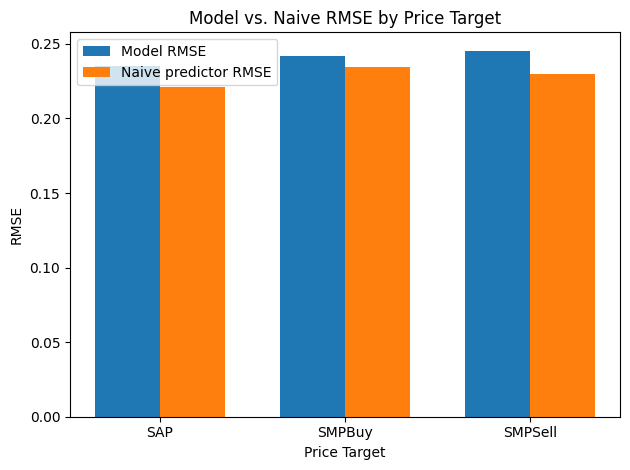

# UK natural gas system price prediction

## NON-TECHNICAL EXPLANATION
This project aims to use machine learning to predict commodity prices, given a few market fundamentals, and previous prices. I have chosen the UK natural gas market because supply, demand and price data are freely available.

The goal is to predict three daily prices, one day in advance:
(1) the System Average Price: the average price for gas for same-day delivery
(2) the System Marginal Price (Buy): the price that suppliers pay when their customers have used more gas than they have supplied to the network.
(3) the System Marginal Price (Sell): the price that suppliers receive for surplus gas.

## DATA

All data used is drawn from the five year history available at https://data.nationalgas.com/, focusing on the fields that make up the Daily Summary Report, with the data for the three target prices coming from the Prices section. The names of the individual data items are listed in the datasheet (data_sheet.md), and their unique identifiers in the file "PUB ids.txt", both of which accompany this README file. The data used to train, validate and test the model covered the period 2021-04-01 to 19th April 2025. 2021-04-01 was chosen as the earliest date to use because that roughly coincided with the easing of Covid restrictions in the UK, which had interrupted normal gas usage patterns.

This is high-level data drawn from industrial operations and/or a highly liquid commodity market, so should be relatively free of the kind of ethical considerations that can accompany human data.

## MODEL 

The model's output is a prediction of the following day's System Average Price, System Marginal Price (Buy) and System Marginal Price (Sell) for the UK national gas transmission system.

Its architecture consists of three sklearn Random Forest regressors: one for each of the above price targets. 

Random Forest was selected as the best performing model type, out of a shortlist of types appropriate to a regression problem, comprising: linear regression; random forest; gradient boosting; a Long Short-Term Memory (LSTM) Recurrent Neural Network; and a residual model LSTM RNN. 
All candidates were trained on the earliest 70% of the data (gas days 2021-04-01 to 2024-02-11) and validated on the next 20% (gas days 2024-02-12 to 2024-11-26) based on Root Mean Squared Error, as compared with the RMSE of a naive prediction that assumed that the next day's price for each of the three price targets would be the same as the current day's. 

The best machine learning model based on this validation for all three price targets was a Random Forest regressor. That choice might have been influenced by having used RMSE as the single evaluation metric, because random forests are able to confine large price change situations, with more scope for large errors, to a small part of the tree, whereas for something like linear regression, they would affect the coefficients for all predictions.  Even so, none of the models, including Random Forest, outperformed the naive prediction. 

## HYPERPARAMETER OPTIMSATION

The implementation of Random Forest used here is scikit-learn's. Optimal hyperparameters were selected using a dual process of Bayesian optimisation (as implemented by scikit-toptimize) running alongside random search (scikit-learn), using 50 iterations of each. The whole process was run three times, with the least profitable parts of the search space for each parameter discarded after the first two runs, in order to exploit the most profitable parts in the final run. The Random Forest for each of the three price targets was tuned individually. The optimal hyperparameters for SAP and SMPBuy were found by the random search, and the optimal hyperparameters for SMPSell were found by the Bayesian optimisation, though there was not a significant difference in the models optimised in the two ways for each of the three price targets.
Available hyperparameters, and their values for each Random Forest, are as follows:

| Hyperparameter  | Description| SAP   | SMPBuy    | SMPSell |
|--------|--------------|---------------|------|------|
| n_estimators    |The number of trees in the forest. |300       | 300        | 423 |
| min_samples_split | The minimum number of training samples required to split an internal node| 5      | 2        | 2|
| min_samples_leaf| The minimum number of samples required to be at a leaf node |2       | 2        | 1|
| max_features| The number of features to consider when looking for the best split, as a fraction of the total number of features |1.0       | 0.9        |1.0 |
| max_depth | The maximum depth of the tree|20 | 10 | 10 |
| ccp_alpha | Complexity parameter used for Minimal Cost-Complexity Pruning |0.005 | 0.005 | 0.0084 * |

\* Rounded to 4dp

## RESULTS

When tested against the latest 10% of the data (covering 24th November 2024 to 19th April 2025) these were the Root Mean Squared Errors of the predictions of the tuned Random Forest regressor for each price label, and for comparison, the RMSE for the naive predictions (tomorrow's price = today's price). The naive predictions were slightly better (lower RMSE) in all cases. 

| Price  | Model RMSE   | Naive RMSE    |
|--------|--------------|---------------|
| SAP    | 0.2355       | 0.2208        |
| SMPBuy | 0.2417       | 0.2348        |
| SMPSell| 0.2455       | 0.2298        |

In conclusion, as often in price prediction, the naive predictor has proved to be a strong one and none of the machine learning models here has succeeded in learning anything from the fundamentals data to improve on it. One issue might be that, although times of Covid restrictions up to 2021 were excluded from the training set, 2022 was also a volatile year for the UK gas market (including the Russian invasion of Ukraine), but that was retained in order to ensure an adequate dataset size. That might have led to overfitting to conditions of higher variance, reducing the likelihood of improving on the naive estimator in less volatile conditions. It might also have improved the model to include other data sources, such as UK NBP gas futures prices, or spot prices in European markets such as TTF in the Netherlands, as these are connected.

## CONTACT DETAILS

mike.westcott@faulconbridge.co.uk

https://www.linkedin.com/in/mike-westcott/

